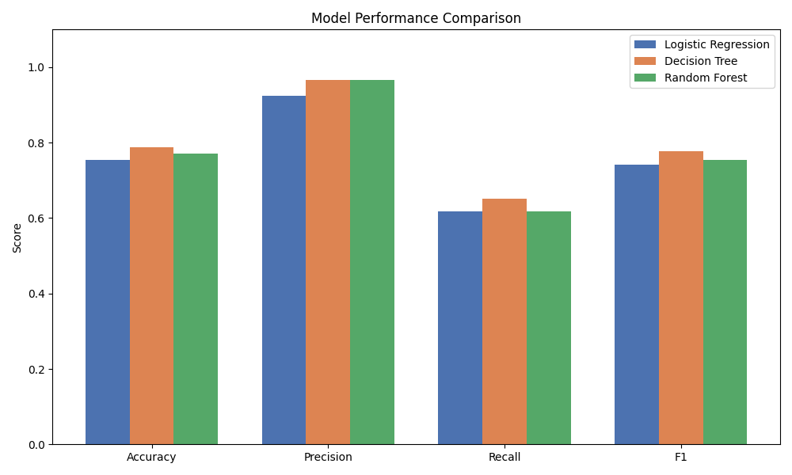
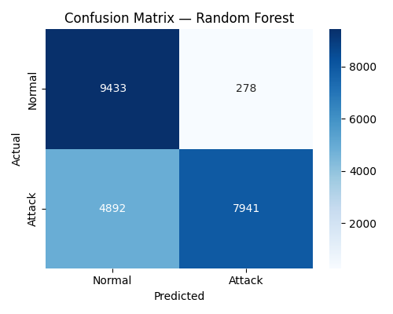

<div align="center">

# ML-NIDS: A Machine Learning-Based Network Intrusion Detection System

**An empirical evaluation of supervised learning for binary intrusion classification on the NSL-KDD benchmark dataset**

[](https://www.python.org/)
[](https://scikit-learn.org/)
[](https://flask.palletsprojects.com/)
[](#license)

[Abubakar Mahmood Muhammad](#author--contact) · Federal University Dutse, Jigawa State · Department of Cyber Security

</div>

---

## Abstract

Signature-based intrusion detection systems are structurally unable to detect attacks whose signatures have not yet been recorded, leaving networks exposed to novel and evolving threats. This project designs, implements, and critically evaluates a machine learning-based Network Intrusion Detection System (ML-NIDS) that classifies network traffic as *normal* or *malicious*. Three supervised classifiers — Logistic Regression, Decision Tree, and Random Forest — are trained on the NSL-KDD benchmark dataset under a consistent preprocessing pipeline and evaluated using accuracy, precision, recall, and F1-score, under **both** the official train/test partition and 5-fold cross-validation. The two protocols produce markedly different results (e.g. Decision Tree: 78.85% accuracy on the held-out test set vs. 99.80% under cross-validation), a gap traced to attack types present in the test set but entirely absent from training, and to the persistent difficulty of detecting Remote-to-Local (R2L) attacks. The best-performing model is deployed in a lightweight Flask web application that classifies uploaded traffic in real time. The project's core contribution is methodological: it demonstrates empirically that reported IDS performance is inseparable from the evaluation protocol used to produce it, and that this distinction is frequently obscured in applied machine learning work.

## Motivation

Modern networks generate traffic volumes and attack patterns that have outpaced the capacity of manually maintained, rule-based detection systems. Machine learning offers a data-driven alternative capable of generalising beyond known attack signatures. This project investigates that premise directly, using a standard, reproducible benchmark (NSL-KDD) rather than a proprietary or synthetic dataset, so that results can be meaningfully compared against the wider literature.

## Methodology

1. **Data acquisition** — NSL-KDD (`KDDTrain+`: 125,973 records; `KDDTest+`: 22,544 records), 41 traffic features plus a label and a difficulty score.
2. **Preprocessing** (`src/preprocess.py`) — categorical encoding (`protocol_type`, `service`, `flag`) via `LabelEncoder`, feature scaling via `StandardScaler`, and binary label collapsing (`normal` = 0, any attack = 1).
3. **Model training** (`src/train.py`) — Logistic Regression, Decision Tree, and Random Forest, trained with fixed random seeds for reproducibility.
4. **Evaluation** (`src/evaluate.py`, `analysis.py`) — accuracy, precision, recall, F1, and confusion matrices computed under two protocols:
   - the official `KDDTrain+` / `KDDTest+` partition (the harder, more realistic test), and
   - 5-fold stratified cross-validation within `KDDTrain+` only (the more commonly reported, and more optimistic, protocol).
5. **Deployment** (`app/`) — the Random Forest model is served through a Flask application that accepts a CSV of traffic records and returns a classification and confidence score per row.

This pipeline and its findings are documented in full, with supporting literature review, in the accompanying dissertation (Chapters 1–5).

## Results

**Official test partition (`KDDTest+`):**

| Model | Accuracy | Precision | Recall | F1-score |
|---|---|---|---|---|
| Logistic Regression | 75.39% | 92.52% | 61.76% | 74.07% |
| Decision Tree | **78.85%** | 96.65% | **65.11%** | **77.81%** |
| Random Forest | 77.07% | **96.62%** | 61.88% | 75.44% |

**5-fold cross-validation (within `KDDTrain+` only):**

| Model | Accuracy | Precision | Recall | F1-score |
|---|---|---|---|---|
| Logistic Regression | 95.38% | 95.99% | 94.01% | 94.99% |
| Decision Tree | 99.80% | 99.80% | 99.77% | 99.78% |
| Random Forest | 99.89% | 99.95% | 99.82% | 99.88% |

### Discussion

The 20–23 point accuracy gap between the two protocols is not attributable to overfitting alone: 17 of the 37 attack types in `KDDTest+` (16.63% of test records) never appear in `KDDTrain+` at all, so no amount of cross-validation within the training set can measure a model's ability to generalise to them. Consistent with this, R2L attacks — which make up only 0.83% of training records but 13.10% of test records — account for roughly 57% of the Random Forest's missed detections. The practical implication is that cross-validation accuracy, while useful for model selection, should not be read as an estimate of real-world detection performance; the held-out test partition is the more honest figure. Full per-category recall, feature importance, and class-imbalance analysis are in `results/`.

## Screenshots

<p align="center">
  
  
</p>

Additional charts (`feature_importance.png`, `cm_decision_tree.png`, `cm_logistic_regression.png`) are in `app/static/`. A full console walkthrough of installation, training, and evaluation is in [`docs/screenshots/`](docs/screenshots/).

## Project Structure

```
nids-project/
├── app/
│   ├── app.py              # Flask application (entry point for the web interface)
│   ├── templates/
│   │   └── index.html      # Upload UI
│   └── static/              # Generated charts used by the app (confusion matrices, etc.)
├── src/
│   ├── explore.py          # Initial dataset exploration
│   ├── preprocess.py       # Cleans, encodes, and scales the NSL-KDD data
│   ├── train.py             # Trains and saves the three classifiers
│   └── evaluate.py         # Evaluates saved models on the test set
├── analysis.py              # Cross-validation, class imbalance, and feature-importance analysis
├── generate_sample.py       # Builds a small sample CSV for quickly testing the web app
├── check_install.py         # Verifies all required libraries are installed
├── data/                    # NSL-KDD CSVs and preprocessed .npy arrays
├── models/                  # Saved model, scaler, and encoder artifacts (.pkl)
├── results/                 # Metrics, cross-validation, and analysis output (.csv/.txt)
├── requirements.txt
└── README.md
```

## Tech Stack

Python 3 · pandas · NumPy · scikit-learn · Flask · matplotlib · seaborn · joblib

## Dataset

This project uses **NSL-KDD**, an improved version of the KDD Cup 1999 dataset that removes redundant records and reduces bias toward more frequent attack classes (Tavallaee et al., 2009). If the CSVs are not already present in `data/`, they can be obtained from the [Canadian Institute for Cybersecurity's NSL-KDD page](https://www.unb.ca/cic/datasets/nsl.html).

## Reproducing This Work

### 1. Clone and set up the environment

```bash
git clone https://github.com/<your-username>/<your-repo-name>.git
cd <your-repo-name>
python -m venv venv
source venv/bin/activate      # on Windows: venv\Scripts\activate
pip install -r requirements.txt
python check_install.py       # verifies all dependencies installed correctly
```

### 2. Run the full pipeline (pre-trained models are already included in `models/`, so this step is optional)

```bash
python src/preprocess.py   # produces data/X_train.npy, X_test.npy, y_train.npy, y_test.npy
python src/train.py        # trains and saves all three classifiers to models/
python src/evaluate.py     # evaluates saved models, writes metrics to results/
python analysis.py         # cross-validation, class imbalance, and feature-importance analysis
```

### 3. Run the web application

```bash
python app/app.py
```

Open **http://127.0.0.1:5000** and upload a CSV of traffic records — `data/test_sample.csv` (generated via `generate_sample.py`) provides a ready-made example with a labelled counterpart for verifying predictions.

## Limitations

- Recall on rare and unseen attack types (particularly R2L) is low, a known limitation of supervised learning constrained by its training distribution rather than of any single model.
- NSL-KDD reflects network traffic patterns from its era rather than current threat conditions.

## Future Work

- Evaluation against more recent traffic datasets (e.g. CIC-IDS2017, UNSW-NB15)
- Resampling and cost-sensitive learning to address severe class imbalance (U2R: 52 training records vs. 67 in test)
- Integration with live packet capture for real-time, streaming deployment

## Citation

If you reference this work, please cite it as:

```bibtex
@misc{nids2026,
  author       = {Abubakar Mahmood Muhammad},
  title        = {ML-NIDS: A Machine Learning-Based Network Intrusion Detection System},
  year         = {2026},
  howpublished = {\url{https://github.com/<your-username>/<your-repo-name>}},
  note         = {Final year project, Department of Cyber Security, Federal University Dutse, Jigawa State}
}
```

## References

- Buczak, A. L., & Guven, E. (2016). A survey of data mining and machine learning methods for cyber security intrusion detection. *IEEE Communications Surveys & Tutorials*.
- Mitchell, T. M. (1997). *Machine learning*. McGraw-Hill.
- Pedregosa, F., Varoquaux, G., Gramfort, A., Michel, V., Thirion, B., Grisel, O., Blondel, M., Prettenhofer, P., Weiss, R., Dubourg, V., Vanderplas, J., Passos, A., Cournapeau, D., Brucher, M., Perrot, M., & Duchesnay, É. (2011). Scikit-learn: Machine learning in Python. *Journal of Machine Learning Research, 12*, 2825–2830.
- Scarfone, K., & Mell, P. (2007). *Guide to intrusion detection and prevention systems (IDPS)* (NIST Special Publication 800-94). National Institute of Standards and Technology.
- Tavallaee, M., Bagheri, E., Lu, W., & Ghorbani, A. A. (2009). A detailed analysis of the KDD CUP 99 data set. *IEEE Symposium on Computational Intelligence for Security and Defense Applications*.

## Author & Contact

**Abubakar Mahmood Muhammad**
Federal University Dutse, Jigawa State, Department of Cyber Security
[LinkedIn](https://www.linkedin.com/in/abubakarmahmoodmuhammad/)

## License

This project is released under the [MIT License](#) — add a `LICENSE` file if you'd like to formalise this, or replace this section if the work is submitted for academic assessment only.

## Acknowledgements

This project was completed as a final year dissertation project. See the full dissertation (Chapters 1–5) for the complete literature review, methodology, and discussion underpinning this implementation.
